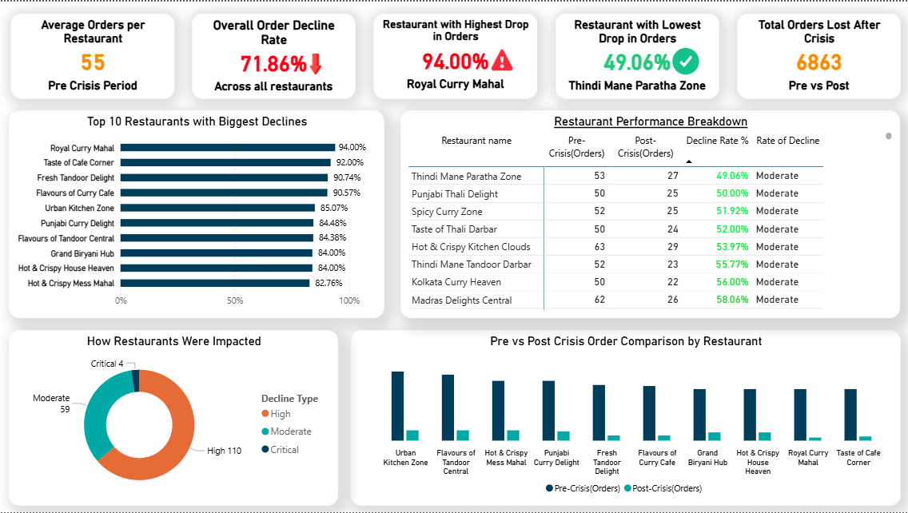
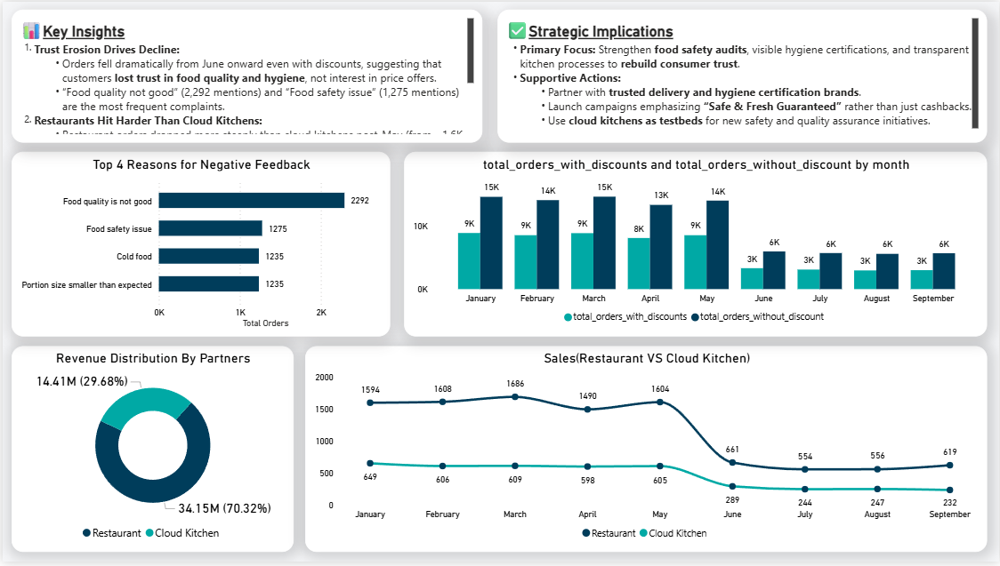

<div align="center">

# 🚀 QuickByte Express - Crisis Recovery Analytics Dashboard


### A comprehensive Power BI analytics solution designed to guide an online food delivery startup through crisis recovery by providing actionable insights across customer behavior, operations, and business strategy.

[View Demo](#-screenshots) · [Report Bug](https://github.com/yourusername/quickbyte-express/issues) · [Request Feature](https://github.com/yourusername/quickbyte-express/issues)

</div>

---

## 📋 Table of Contents

- [Overview](#-overview)
- [Key Features](#-key-features)
- [Screenshots](#-screenshots)
- [Prerequisites](#-prerequisites)
- [Installation](#-installation)
- [Data Sources](#-data-sources)
- [Dashboard Insights](#-dashboard-insights)
- [Project Structure](#-project-structure)
- [Contributing](#-contributing)
- [Acknowledgments](#-acknowledgments)
- [License](#-license)
- [Contact](#-contact)

---

## 🎯 Overview

**QuickByte Express** is a strategic analytics dashboard developed as part of the **Codebasics Resume Project Challenge**. This Power BI solution helps an online food delivery startup navigate post-crisis recovery by transforming raw data into actionable intelligence.

The dashboard addresses critical business questions across six key dimensions, enabling management to make data-driven decisions for sustainable recovery and growth.

### 🎪 Project Highlights

- 📊 **6 Key Analysis Dimensions** covering customer, operations, and strategy
- 🔄 **Three-Phase Analysis** tracking pre-crisis, crisis, and recovery periods
- 📈 **Interactive Visualizations** for deep-dive analysis
- 🎯 **Actionable Recommendations** for business recovery strategies

---

## ✨ Key Features

<table>
<tr>
<td width="50%">

### 📊 Customer Segmentation Analysis
- Identify recoverable customer segments vs. those requiring new engagement strategies
- Analyze customer lifetime value and churn patterns
- Track retention rates across different demographics

</td>
<td width="50%">

### 📈 Order Pattern Intelligence
- Comprehensive trend analysis across three phases: pre-crisis, crisis, and recovery
- Behavioral change detection and pattern recognition
- Peak ordering times and seasonal variations

</td>
</tr>
<tr>
<td width="50%">

### 🚚 Delivery Performance Metrics
- Real-time monitoring of delivery times and SLA compliance
- Cancellation rate analysis and root cause identification
- Operational bottleneck detection and optimization opportunities

</td>
<td width="50%">

### 🎯 Campaign Opportunity Recommendations
- Targeted marketing initiative suggestions based on demographic insights
- Customer trust and loyalty rebuilding strategies
- ROI predictions for different campaign scenarios

</td>
</tr>
<tr>
<td width="50%">

### 🤝 Restaurant Partnership Predictions
- Valuable partnership identification for long-term retention
- Performance scoring of existing restaurant partners
- Strategic recommendations for partnership portfolio optimization

</td>
<td width="50%">

### 💬 Feedback & Sentiment Analysis
- Real-time rating and review monitoring
- Sentiment trend tracking across recovery phases
- Actionable insights from customer feedback

</td>
</tr>
</table>

---

## 📸 Screenshots

### 🏪 Restaurant Performance Analysis

*Comprehensive view of restaurant order trends, decline rates, and performance breakdown across crisis phases*

**Key Metrics Shown:**
- 📊 Overall order decline rate: **71.86%** across all restaurants
- 🔴 Highest drop: Royal Curry Mahal at **96.00%**
- 🟢 Lowest drop: Thindi Mane Paratha Zone at **49.06%**
- 📉 Top 10 restaurants with biggest declines
- 🎯 Restaurant performance breakdown with pre/post crisis comparison

---

### 💡 Strategic Insights & Customer Feedback

*Deep dive into customer feedback, trust factors, and revenue distribution patterns*

**Analysis Highlights:**
- 🔍 **Key Insights:** Trust erosion and restaurant-cloud kitchen dynamics
- ✅ **Strategic Implications:** Food safety focus and quality assurance recommendations
- 📊 **Top Negative Feedback Reasons:** Food quality issues (2,292 mentions)
- 💰 **Revenue Distribution:** Restaurant vs Cloud Kitchen analysis
- 📈 **Discount Impact:** Orders with vs without discounts tracked monthly
- 📉 **Sales Trends:** Restaurant performance vs Cloud Kitchen comparison

---

<details>
<summary>📁 Screenshot Files Structure</summary>

```
dashboard_views/
├── P3.png
├── S3.png
└── [add more screenshots here]
```

</details>

---

## 🛠️ Prerequisites

Before you begin, ensure you have the following installed:

- **Power BI Desktop** (Latest version recommended)
  - 📥 [Download Power BI Desktop](https://powerbi.microsoft.com/desktop/)
- **Microsoft Excel** or compatible CSV reader (for viewing raw data)
- **Windows 10/11** or compatible OS

### 📦 Recommended Specifications

| Component | Requirement |
|-----------|-------------|
| RAM | 8GB or higher |
| Storage | 500MB free space |
| Display | 1920x1080 resolution or higher |

---

## 🚀 Installation

### Step 1: Clone the Repository

```bash
git clone https://github.com/yourusername/quickbyte-express.git
cd quickbyte-express
```

### Step 2: Open the Power BI File

1. Navigate to the project directory
2. Open `QuickByte_Express_Dashboard.pbix` with Power BI Desktop

### Step 3: Refresh Data Connections

1. Click on **Home** → **Refresh** in Power BI Desktop
2. If prompted, update data source paths to point to the CSV files in the `data/` folder
3. Review and apply any pending transformations

### Step 4: Explore the Dashboard

- Navigate through different report pages
- Interact with filters and slicers
- Drill down into specific metrics

---

## 📁 Data Sources

This project utilizes CSV datasets covering various aspects of the food delivery business:

| Dataset | Description | Format |
|---------|-------------|--------|
| `dim_customer.csv` | Customer demographics and segmentation data | CSV |
| `dim_delivery_partner.csv` | Delivery Partner Data | CSV |
| `dim_menu_item.csv` | Menu item details(prices,etc) | CSV |
| `dim_restaurant.csv` | Restaurant demographics and other info | CSV |
| `fact_delivery_performance.csv` | Delivery performance data | CSV |
| `fact_ratings.csv` | Ratings given by customers | CSV |
| `fact_orders.csv` | Order level details per order | CSV |
| `fact_order_items.csv` | Order items data | CSV |

### 🔄 Data Refresh

- Data is imported from CSV files located in the `data/` folder
- To update with new data, replace CSV files and refresh the Power BI report
- Ensure new data maintains the same schema structure

---

## 💡 Dashboard Insights

### 1️⃣ Customer Segments

Identifies which customers can be recovered through:
- Segmentation by order frequency and recency
- Customer lifetime value analysis
- Churn prediction and risk scoring

### 2️⃣ Order Patterns

Uncovers behavioral changes through:
- Time-series analysis across crisis phases
- Day-of-week and hour-of-day patterns
- Order value and frequency trends

### 3️⃣ Delivery Performance

Pinpoints operational gaps via:
- Average delivery time tracking
- SLA compliance monitoring
- Cancellation analysis by reason and geography

### 4️⃣ Campaign Opportunities

Recommends targeted initiatives using:
- Demographic-based segmentation
- Response rate predictions
- Budget allocation optimization

### 5️⃣ Restaurant Partnerships

Predicts valuable partnerships through:
- Performance scoring matrix
- Customer preference analysis
- Revenue contribution metrics

### 6️⃣ Feedback & Sentiment

Guides recovery efforts with:
- Real-time sentiment scoring
- Rating trend analysis
- Theme extraction from reviews

---

## 📂 Project Structure

```
quickbyte-express/
│
├── data/                          # CSV datasets
│   ├── customers.csv
│   ├── orders.csv
│   ├── delivery.csv
│   ├── restaurants.csv
│   ├── feedback.csv
│   └── campaigns.csv
│
├── screenshots/                   # Dashboard screenshots
│   └── ...
│
├── QuickByte_Express_Dashboard.pbix  # Main Power BI file
├── README.md                      # Project documentation
└── LICENSE                        # License file
```

---

## 🤝 Contributing

Contributions are welcome! If you'd like to improve this project:

1. Fork the repository
2. Create a feature branch (`git checkout -b feature/AmazingFeature`)
3. Commit your changes (`git commit -m 'Add some AmazingFeature'`)
4. Push to the branch (`git push origin feature/AmazingFeature`)
5. Open a Pull Request

---

## 🙏 Acknowledgments

- **[Codebasics](https://codebasics.io/)** - For providing the Resume Project Challenge
- **Power BI Community** - For inspiration and best practices
- All contributors and reviewers

---

## 📄 License

This project is part of the **Codebasics Resume Project Challenge** and follows their guidelines and terms.

---

## 📧 Contact

**RIMON GHOSH**

[](https://linkedin.com/in/yourprofile)
[](https://www.novypro.com/profile_projects/yourprofile)
[](https://www.youtube.com/watch?OuCA8RfgszA)
[](https://github.com/yourusername)
[](mailto:your.email@example.com)

**Project Links:**
- 🎥 [Watch Video Presentation on YouTube](https://www.youtube.com/watch?v=OuCA8RfgszA)
- 📊 [View Live Dashboard on NovyPro](https://project.novypro.com/kIuIgd)
- 💼 [Connect on LinkedIn](https://www.linkedin.com/in/rimonghosh/)
- 🐙 [GitHub Repository](https://github.com/ghorimon/quickbyte-express)

---

<div align="center">

### ⭐ If you find this project helpful, please give it a star!

**Made with ❤️ for the Codebasics Resume Project Challenge**

[](https://codebasics.io/)

</div>
